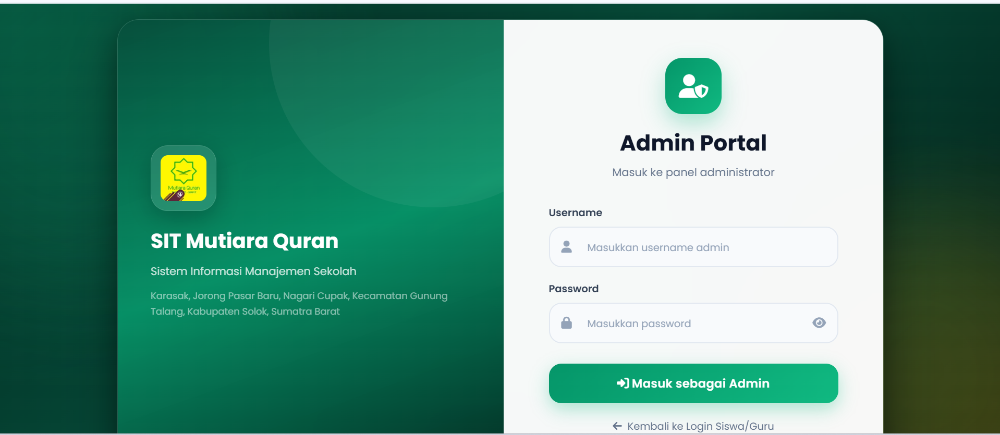
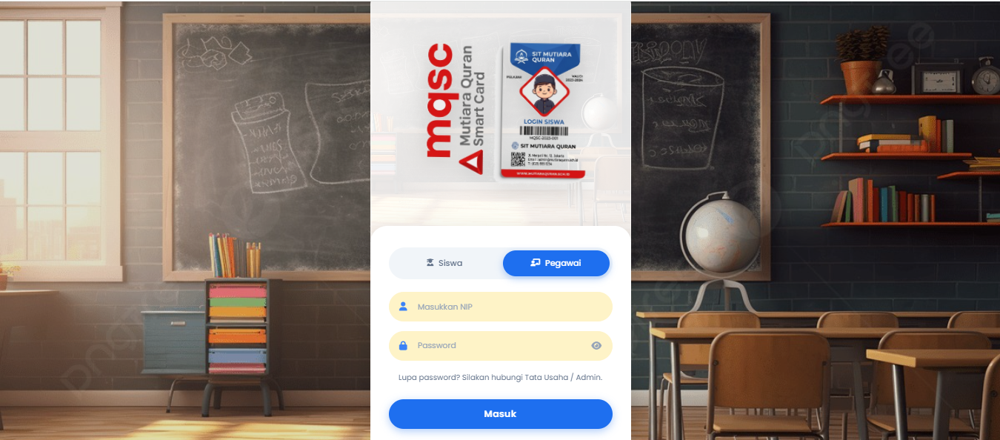
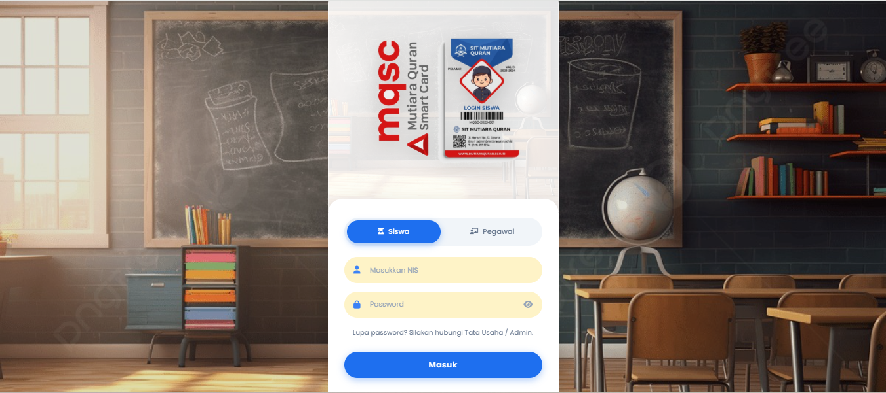
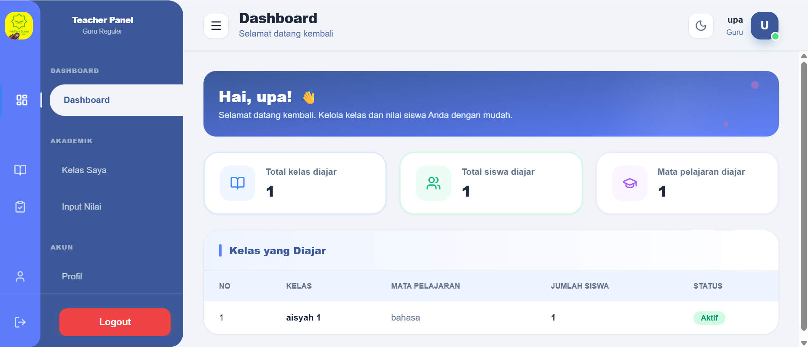
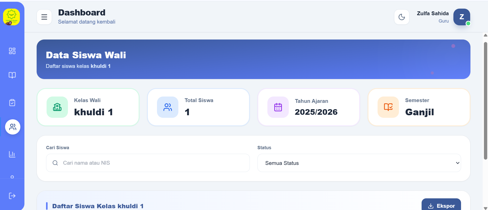
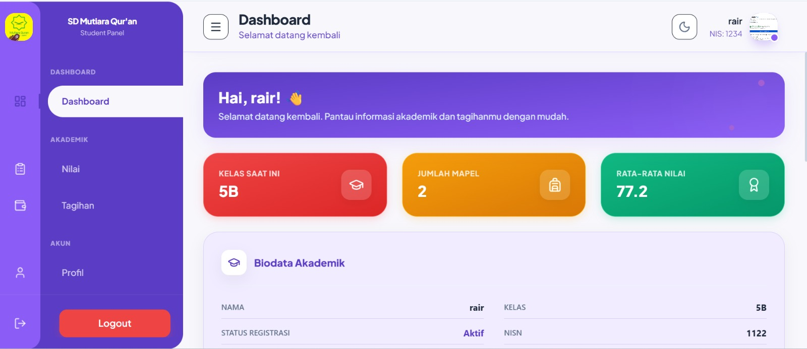
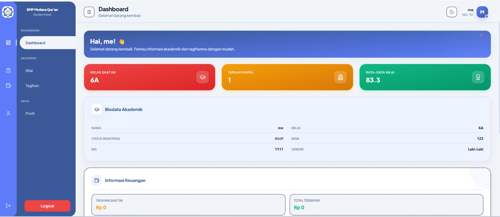

# Sistem Informasi Sekolah Islam Terpadu (SIT)

## Deskripsi Project

Sistem Informasi Sekolah Islam Terpadu (SIT) merupakan aplikasi berbasis web yang dirancang untuk membantu digitalisasi pengelolaan akademik dan penyebaran informasi sekolah secara terintegrasi.

Sistem ini terdiri dari dua bagian utama:

- Website Publik Sekolah
- Sistem Informasi Akademik

Website publik digunakan untuk menyampaikan informasi sekolah kepada masyarakat seperti profil sekolah, berita, kegiatan, informasi PPDB, serta informasi kontak sekolah.

Sementara itu, sistem akademik digunakan oleh Admin, Guru, Wali Kelas, dan Siswa untuk mengelola aktivitas akademik secara digital seperti pengelolaan data siswa, nilai, jadwal pelajaran, tagihan sekolah, dan informasi akademik lainnya.

Project ini dikembangkan menggunakan Laravel Framework dengan tampilan modern, responsif, serta sistem autentikasi berbasis role.

---

## Tujuan Sistem

- Mempermudah pengelolaan data akademik sekolah.
- Membantu guru dalam proses penginputan nilai siswa.
- Membantu wali kelas dalam memonitor perkembangan akademik siswa.
- Mempermudah siswa mengakses informasi akademik secara mandiri.
- Menyediakan sistem administrasi tagihan sekolah secara digital.
- Meningkatkan efisiensi pengelolaan data dan informasi sekolah.
- Menyediakan media informasi sekolah yang terintegrasi.

---

## SDGs yang Didukung

### SDG 4 – Quality Education (Pendidikan Berkualitas)

Project ini mendukung digitalisasi layanan pendidikan guna meningkatkan kualitas pengelolaan informasi dan layanan akademik sekolah.

---

# Fitur Utama

## Website Publik

- Halaman Beranda
- Profil Sekolah
- Visi dan Misi
- Unit Pendidikan (TK, SD, SMP)
- Berita dan Kegiatan
- Informasi PPDB
- Kontak Sekolah
- Lokasi Sekolah

---

## Sistem Autentikasi

- Login Multi Role
- Login Admin
- Login Guru
- Login Wali Kelas
- Login Siswa
- Forgot Password
- Reset Password
- Enkripsi Password

---

## Dashboard Admin

Admin memiliki akses penuh terhadap seluruh sistem.

### Fitur Admin

- CRUD User
- CRUD Guru
- CRUD Siswa
- CRUD Wali Kelas
- CRUD Kelas
- CRUD Mata Pelajaran
- CRUD Jadwal Pelajaran
- CRUD Tahun Ajaran
- CRUD Tagihan
- CRUD Berita
- CRUD PPDB
- Manajemen Kontak Sekolah
- Monitoring Nilai Siswa
- Monitoring Pembayaran Tagihan
- Manajemen Hak Akses dan Role

---

## Dashboard Guru

Guru bertanggung jawab terhadap pengelolaan nilai berdasarkan mata pelajaran yang diampu.

### Fitur Guru

- Melihat Jadwal Mengajar
- Melihat Daftar Kelas
- Melihat Daftar Siswa
- Input Nilai Siswa
- Edit Nilai
- Rekap Nilai Mata Pelajaran

---

## Dashboard Wali Kelas

Wali kelas bertugas memonitor perkembangan akademik siswa dalam kelas yang diampu.

### Fitur Wali Kelas

- Melihat Daftar Siswa dalam Kelas
- Monitoring Nilai Siswa
- Melihat Rekap Nilai Kelas
- Monitoring Data Akademik Siswa

---

## Dashboard Siswa

Siswa dapat mengakses informasi akademik secara mandiri.

### Fitur Siswa

- Melihat Profil
- Melihat Nilai
- Melihat Jadwal Pelajaran
- Melihat Tagihan Sekolah
- Melihat Riwayat Pembayaran

---

## Fitur Tagihan Siswa

Sistem menyediakan fitur administrasi keuangan sekolah secara digital.

### Fitur Keuangan

- Informasi Tagihan Siswa
- Detail Nominal Tagihan
- Status Pembayaran
- Upload Bukti Pembayaran
- Riwayat Pembayaran
- Monitoring Pembayaran oleh Admin

---

# Role Pengguna

| Role | Hak Akses |
|--------|------------|
| Admin | Mengelola seluruh data sistem |
| Guru | Mengelola dan menginput nilai siswa |
| Wali Kelas | Monitoring perkembangan akademik siswa |
| Siswa | Melihat nilai, jadwal, dan tagihan |
| Pengunjung | Mengakses website publik |

---

# Teknologi yang Digunakan

- Laravel
- PHP
- MySQL
- Tailwind CSS
- JavaScript
- Blade Template
- Git
- GitHub
- Figma

---

# Tampilan Sistem

## Login Admin



---

## Login Guru



---

## Login Siswa



---

## Dashboard Admin


---

## Dashboard Guru



---

## Dashboard Wali Kelas



---

## Dashboard Siswa SD



---

## Dashboard Siswa SMP



---

# Instalasi Project

## Clone Repository

```bash
git clone https://github.com/gadizafauzi/letss-it-pbl.git
cd letss-it-pbl
```

## Install Dependency

```bash
composer install
npm install
```

## Konfigurasi Environment

```bash
cp .env.example .env
```

Sesuaikan konfigurasi database:

```env
DB_CONNECTION=mysql
DB_HOST=127.0.0.1
DB_PORT=3306
DB_DATABASE=school_app
DB_USERNAME=root
DB_PASSWORD=
```

## Generate Application Key

```bash
php artisan key:generate
```

## Migrasi Database

```bash
php artisan migrate --seed
```

## Menjalankan Server

```bash
php artisan serve
```

---

# Default Account

## Admin

Email: admin@gmail.com

Password:

```text
12345678
```

---

## Guru

NIP: Sesuai data yang didaftarkan admin

Password:

```text
12345678
```

---

## Wali Kelas

NIP: Sesuai data yang didaftarkan admin

Password:

```text
12345678
```

---

## Siswa

NISN: Sesuai data yang didaftarkan admin

Password:

```text
12345678
```

---

# Struktur Project

```bash
├── app
├── bootstrap
├── config
├── database
├── public
│   └── images
├── resources
├── routes
├── storage
├── tests
├── vendor
└── README.md
```

---

# Tim Pengembang

| Role | Nama |
|--------|--------|
| Project Manager | Gadiza Fauzi |
| System Analyst | Rezky Andikhe Wahyudi |
| Lead Programmer | Zulfa Sahida |
| Quality Assurance | M. Ilham Fadli Ikbar |
| UI/UX Designer | Ramadhan Al Fitra |

---

# Status Project

🚧 Project masih dalam tahap pengembangan dan akan terus diperbarui dengan fitur-fitur baru.

---

# License

Project ini dibuat untuk kebutuhan pembelajaran, penelitian, dan pengembangan akademik.

---

# Dukungan

Jika project ini bermanfaat, jangan lupa memberikan ⭐ pada repository GitHub ini.

Terima kasih atas dukungannya.